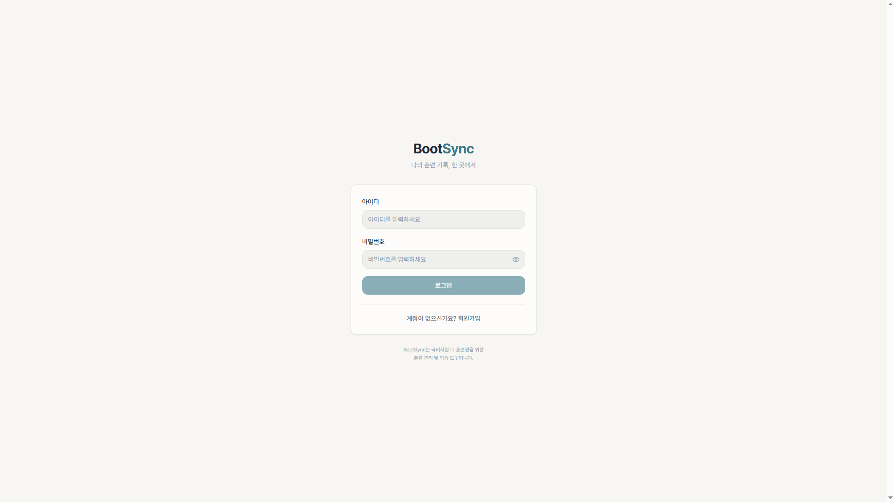
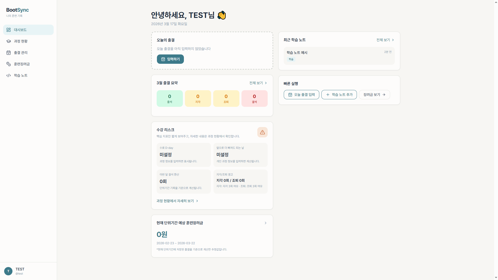
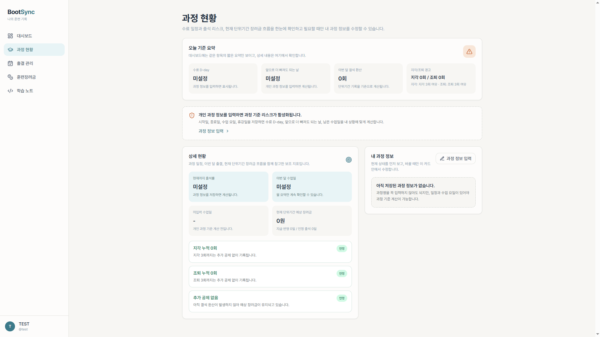
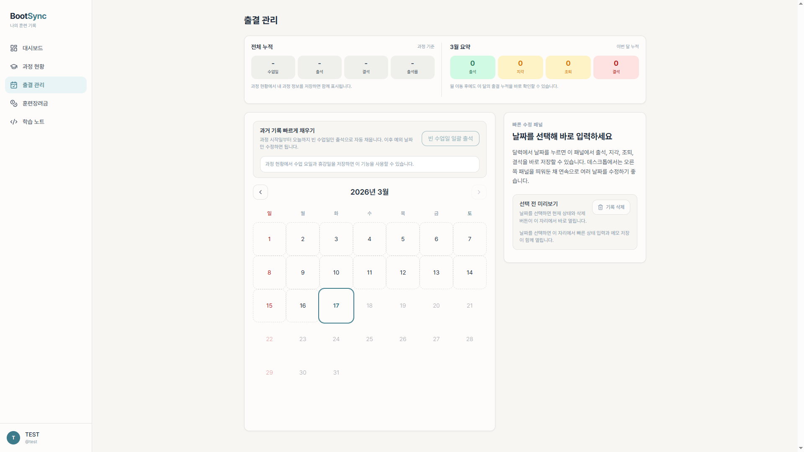
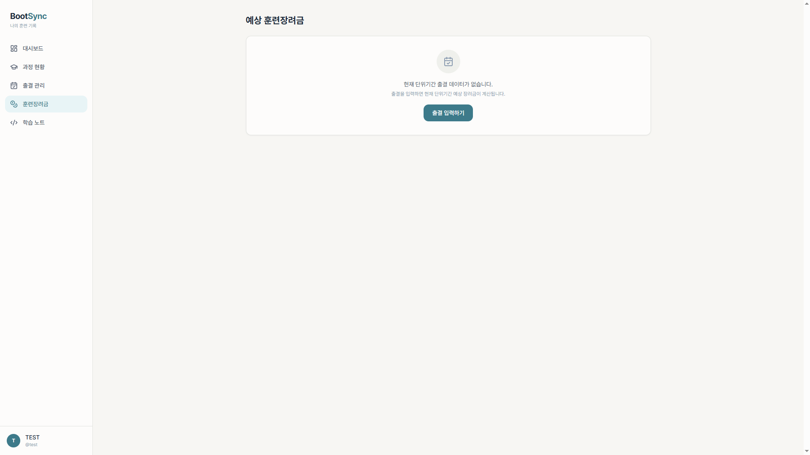
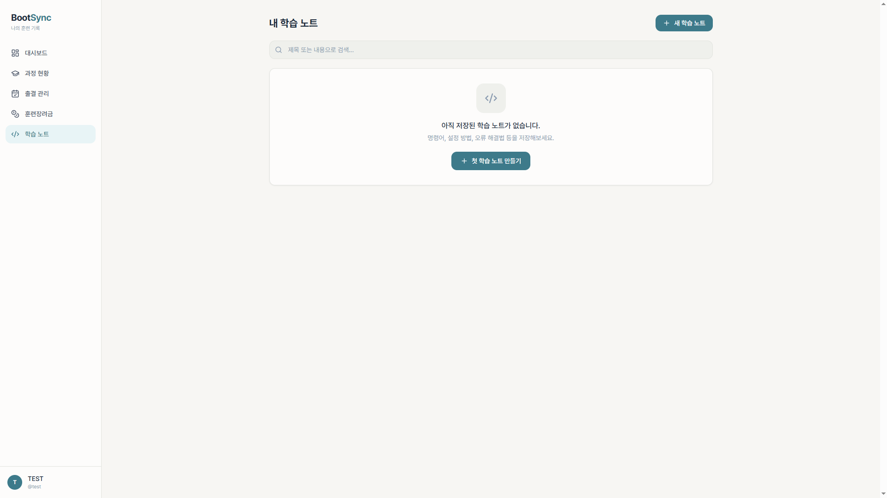
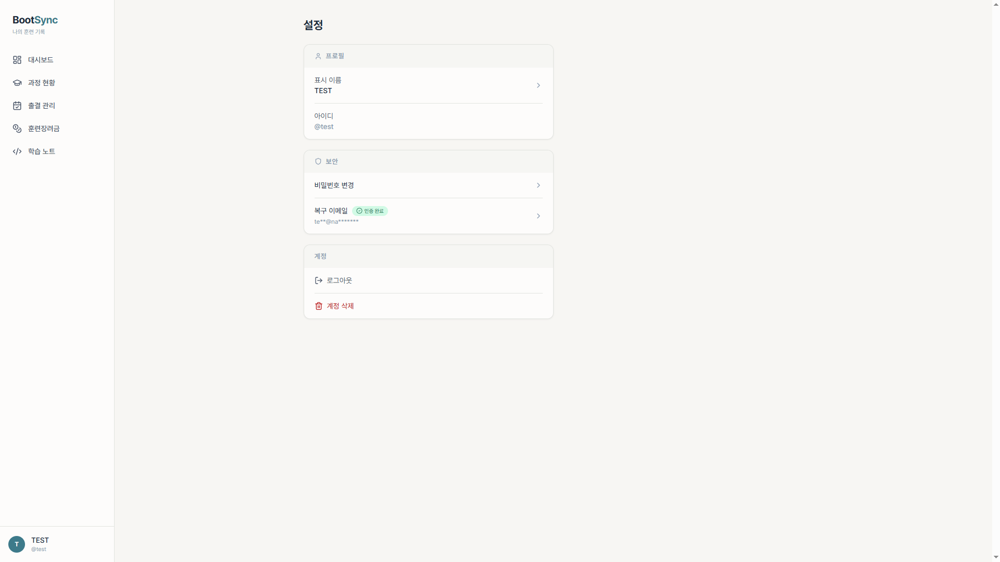
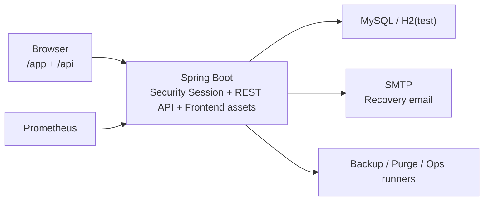

# BootSync

BootSync는 대한민국 국비지원 IT 교육과정 훈련생을 위한 출결, 훈련장려금 예상 금액, 학습 스니펫 관리를 한 곳에서 다루는 same-origin 웹 서비스입니다. Spring Boot 3.x 백엔드와 React `/app` 프론트를 함께 사용하며, 기능 구현뿐 아니라 인증, 운영 문서, 모니터링 준비까지 포함한 실사용형 포트폴리오를 목표로 합니다.

## 현재 상태

- 완료: 회원가입/로그인, recovery email verification, 출결 CRUD, 예상 장려금 계산, 스니펫 CRUD, 설정, 계정 삭제 lifecycle, React `/app` UI, 로컬 테스트
- 진행 중: AWS 실제 배포, SMTP 실메일 smoke test, S3 업로드 증적, prod-like 복원과 `RTO 8시간` 검증, 정책 문서 확정

## 핵심 기능

- 세션 기반 인증, recovery email verification, rate limit, 계정 상태 재검사
- 월별 출결 조회/수정/삭제, 과정 정보 기반 `빈 수업일 일괄 출석`
- `1일 지급액 × 지급 반영 일수` 기준 예상 장려금 계산
- Markdown 기반 학습 노트와 태그 검색, secret warning 저장 흐름
- 계정 삭제 요청, 유예 기간, purge runner, 운영자 보조 복구/취소 절차
- same-origin React `/app` 프론트와 Spring API 결합 구조

## 화면 미리보기

아래 화면은 `test` 프로필 기준 데모 흐름을 캡처한 이미지입니다.

| 로그인 | 대시보드 |
|---|---|
|  |  |

| 과정 현황 | 출결 관리 |
|---|---|
|  |  |

| 예상 훈련장려금 | 학습 노트 |
|---|---|
|  |  |



## 검증 및 운영 기록

- 최신 전체 검증 기록: [2026-03-16-validation-checkpoint.md](docs/reports/checkpoints/2026-03-16-validation-checkpoint.md)
  `frontend npm run lint`, `npm run build`, `.\gradlew.bat compileJava compileTestJava test` 통과 기준을 정리했습니다.
- 로컬 운영 rehearsal: [2026-03-15-ops-rehearsal.md](docs/reports/ops/2026-03-15-ops-rehearsal.md)
  운영자 보조 비밀번호 초기화, purge one-shot, 복원 후 scrub 절차의 로컬 실행 기록입니다.
- 로컬 백업/복원 rehearsal: [2026-03-15-backup-restore-rehearsal.md](docs/reports/ops/2026-03-15-backup-restore-rehearsal.md)
  SQL dump 생성, restore 테스트, row count 검증까지 남긴 기록입니다.
- 운영 절차와 증적 템플릿: [OPERATIONS_RUNBOOK.md](docs/operations/OPERATIONS_RUNBOOK.md), [OPERATIONS_EVIDENCE_TEMPLATES.md](docs/operations/OPERATIONS_EVIDENCE_TEMPLATES.md)
  실제 운영 점검 시 어떤 순서로 실행하고 어떤 증적을 남길지 확인할 수 있습니다.
- 아직 남은 운영 증적: AWS 실제 배포, SMTP 실메일 smoke test, S3 업로드 기록, prod-like 복원과 `RTO 8시간` 검증

## 3단계로 실행

```powershell
.\gradlew.bat test

cd .\frontend
npm install
$env:VITE_BASE_PATH='/app/'
npm run build
cd ..

.\gradlew.bat bootRunTestProfile
```

- 접속 주소: `http://localhost:8080/app`
- 로컬 데모 계정: `d / d`
- 위 계정과 `docker-compose.yml`의 기본 자격증명은 로컬/테스트 전용이며, 운영이나 공개 환경에서 재사용하면 안 됩니다.

## 아키텍처 개요



## 도메인 기본값

- 이 프로젝트는 현재 국비지원 훈련 과정 도메인에 맞춘 vertical product입니다.
- [`src/main/resources/application.yml`](src/main/resources/application.yml)의 `app.training`, `app.allowance` 값은 현재 목표 과정 기준 기본값이며, 전역 SaaS 공통 규칙을 뜻하지 않습니다.
- 실제 앱에서는 사용자별 `내 과정 정보`로 과정 일정과 장려금 규칙을 덮어쓸 수 있습니다.

## 문서 안내

README가 여러 개 보이면 아래 기준으로 보면 됩니다. 처음 들어온 경우에는 이 파일부터 읽는 것을 권장합니다.

| 파일 | 언제 보면 되는지 | 다루는 내용 |
|---|---|---|
| [README.md](README.md) | 처음 프로젝트를 열었을 때 | 전체 소개, 빠른 시작, 로그인 방법, 현재 사용자 화면 동작 |
| [docs/README.md](docs/README.md) | 세부 문서를 찾고 싶을 때 | 명세, 계획, 운영, 정책, 작업 기록 문서 허브 |
| [k8s/README.md](k8s/README.md) | Kubernetes 배포를 준비할 때 | `k8s-bootsync`, `k8s-monitoring`, `k8s-argocd` 적용 순서와 주의사항 |

상세 문서 허브는 [docs/README.md](docs/README.md)입니다.
최종 프로젝트 AWS 방향 가이드는 [AWS_FINAL_PROJECT_GUIDE.md](docs/planning/AWS_FINAL_PROJECT_GUIDE.md)에서 확인할 수 있습니다.
실행용 AWS 배포 체크리스트는 [AWS_DEPLOYMENT_CHECKLIST.md](docs/planning/AWS_DEPLOYMENT_CHECKLIST.md)에서 확인할 수 있습니다.
운영 환경변수 체크리스트는 [PROD_ENV_CHECKLIST.md](docs/operations/PROD_ENV_CHECKLIST.md)에서 확인할 수 있습니다.
운영 증적 템플릿은 [OPERATIONS_EVIDENCE_TEMPLATES.md](docs/operations/OPERATIONS_EVIDENCE_TEMPLATES.md)에서 확인할 수 있습니다.
정책 문서 초안은 [PRIVACY_POLICY_DRAFT.md](docs/policies/PRIVACY_POLICY_DRAFT.md), [TERMS_OF_SERVICE_DRAFT.md](docs/policies/TERMS_OF_SERVICE_DRAFT.md), [ACCOUNT_DELETION_AND_RECOVERY_POLICY.md](docs/policies/ACCOUNT_DELETION_AND_RECOVERY_POLICY.md)에서 확인할 수 있습니다.
작업 이력은 [WORK_LOG.md](docs/history/WORK_LOG.md)에서 확인할 수 있습니다.
최근 운영 rehearsal 기록은 [2026-03-15-ops-rehearsal.md](docs/reports/ops/2026-03-15-ops-rehearsal.md)에서 확인할 수 있습니다.
최근 백업/복원 rehearsal 기록은 [2026-03-15-backup-restore-rehearsal.md](docs/reports/ops/2026-03-15-backup-restore-rehearsal.md)에서 확인할 수 있습니다.
운영 점검 절차는 [OPERATIONS_RUNBOOK.md](docs/operations/OPERATIONS_RUNBOOK.md)에서 확인할 수 있습니다.
최근 전체 비교 검증 기록은 [2026-03-16-validation-checkpoint.md](docs/reports/checkpoints/2026-03-16-validation-checkpoint.md)에서 확인할 수 있습니다.

## 포함된 것

- Spring Boot 3.4.x / Java 17 / Gradle wrapper
- React + Vite 프론트와 Spring Security 기반 세션 로그인
- `member`, `auth`, `dashboard`, `attendance`, `snippet`, `tag`, `settings` 도메인 분리
- JPA 엔티티, Flyway baseline, MySQL Docker Compose
- 복구 이메일 verification token 저장 모델
- 출결 감사 로그
- 스니펫 시크릿 경고 토큰 흐름
- 통합 웹 테스트

## 빠른 시작

### 1. 테스트 실행

```powershell
.\gradlew.bat test
```

테스트 리포트는 `build/reports/tests/test/index.html`에 생성됩니다.

### 2. MySQL 없이 빠르게 화면 확인

```powershell
.\gradlew.bat bootRunTestProfile
```

- 기본 주소: `http://localhost:8080`
- 루트(`/`)로 접속 시 현재 React 프론트인 `/app/login` 또는 `/app/dashboard`로 이동합니다.
- 아직 프론트 번들을 만들지 않았다면 `/app/...` 요청은 옛 화면으로 fallback 되지 않고, 프론트 빌드가 필요하다는 안내 화면을 보여줍니다.
- 포트 변경 예시:

```powershell
.\gradlew.bat bootRunTestProfile --args="--server.port=18080"
```

### 3. MySQL 포함 로컬 실행

```powershell
docker compose up -d mysql
$env:DB_URL='jdbc:mysql://localhost:3307/bootsync?useSSL=false&allowPublicKeyRetrieval=true&serverTimezone=Asia/Seoul&characterEncoding=UTF-8'
$env:DB_USERNAME='bootsync'
$env:DB_PASSWORD='bootsync'
.\gradlew.bat bootRun --args="--spring.profiles.active=local"
```

- 앱 기본 주소: `http://localhost:8080`
- MySQL: `localhost:3307`

앱과 MySQL을 함께 Compose로 띄우려면:

```powershell
docker compose up --build
```

- Docker 이미지 빌드 시 `frontend`도 함께 production build 되어 `/app` 정적 자산으로 포함됩니다.
- Compose 경로는 [docker-compose.yml](docker-compose.yml)에서 `SPRING_PROFILES_ACTIVE=local`을 명시하므로 로컬 개발 기준을 유지합니다.
- Compose의 DB 계정과 데모 계정은 로컬 개발 편의를 위한 기본값이며, 운영 환경에서는 별도 시크릿과 실사용 계정으로 반드시 교체해야 합니다.

포트가 겹치면:

```powershell
$env:APP_PORT='18080'
docker compose up --build
```

### 4. 새 React 프론트엔드 확인

새 프론트 소스는 [frontend](frontend)에 별도로 유지합니다. React 소스와 Spring 백엔드 코드를 직접 섞지 않고, 빌드 결과물만 `/app` 경로로 붙이는 방식입니다.

개발 서버로 프론트만 확인:

```powershell
cd .\frontend
npm install
npm run dev
```

프론트 정적 검증:

```powershell
cd .\frontend
npm run lint
```

Spring 앱에 정적 자산으로 연결:

```powershell
cd .\frontend
$env:VITE_BASE_PATH='/app/'
npm run build
cd ..
.\gradlew.bat bootRunTestProfile
```

- 새 프론트 주소: `http://localhost:8080/app`
- Gradle은 `frontend/dist` 가 있으면 빌드 산출물만 `build/generated-resources/frontend/static/app` 으로 복사해 사용합니다.
- `frontend/dist` 가 아직 없으면 `/app` 라우트는 프론트 빌드 안내 화면을 보여줍니다.
- Dockerfile도 이미지 빌드 중 `frontend`를 자동 빌드해 같은 경로로 포함합니다.
- Kubernetes 매니페스트는 [k8s](k8s) 아래 `k8s-bootsync`, `k8s-monitoring`, `k8s-argocd` 구조로 정리돼 있어 앱 배포, Prometheus/Grafana, Argo CD 템플릿을 분리해서 사용할 수 있습니다.
- 단독 Docker 이미지([Dockerfile](Dockerfile))는 배포 실수를 줄이기 위해 기본 `SPRING_PROFILES_ACTIVE=prod`로 시작하고, final stage는 non-root 사용자 `bootsync`로 실행합니다.
- 따라서 이미지를 `docker run`으로 직접 사용할 때는 `DB_URL`, `DB_USERNAME`, `DB_PASSWORD`와 운영 메일/도메인 설정, 필요 시 `APP_MONITORING_PROMETHEUS_SCRAPE_TOKEN`까지 함께 넘기는 것을 전제로 합니다.
- 앱의 `/actuator/prometheus`는 이제 Bearer 토큰이 있어야 응답하며, Kubernetes 예시는 내부 Prometheus가 같은 토큰으로 스크랩하고 외부 Ingress에서는 `/actuator` 경로를 막는 방향으로 작성돼 있습니다.
- 현재 `/app` 프론트는 세션 확인, 로그인, 회원가입, 출결 조회/수정/삭제, 스니펫 조회/작성/수정/삭제, 설정의 표시 이름/비밀번호/복구 이메일 변경 요청/재발송/계정 삭제 요청까지 실제 백엔드 API를 사용합니다.
- `/app` 프론트의 실제 화면 코드는 더 이상 `mock-data` 모듈에 의존하지 않고, 공용 타입/표시 유틸과 fixture 데이터를 분리해 사용합니다.
- `/app` 출결 관리의 월 카운트는 서버 `monthlySummary` 응답을 사용하고, 대시보드/과정 현황/훈련장려금 화면의 금액 계산은 현재 단위기간 기준 `allowanceSummary` 응답을 사용합니다.
- `/app` 대시보드의 `수강 리스크` 카드는 이제 수료 `D-day`, `앞으로 더 빠져도 되는 날`, 이번 달 결석 환산, 지각/조퇴 경고만 짧게 요약해서 보여 줍니다.
- 과정 일정 기준 리스크 카드는 이제 사용자별 `내 과정 정보`를 우선 사용합니다. 설정이 없는 사용자는 월 요약/장려금 기능은 계속 쓰되, 과정 기준 리스크는 설정 안내만 보게 됩니다.
- `/app/attendance`는 상단 얇은 요약 바에서 `전체 누적`과 `이번 달 요약`을 먼저 보여 주고, 그 아래에서 캘린더와 오른쪽 빠른 수정 패널을 바로 쓰는 구조로 정리했습니다.
- 오른쪽 빠른 수정 패널은 날짜를 누르기 전에는 설명만 보여 주고, 날짜를 선택했을 때만 빠른 상태 입력과 메모 저장 영역이 열립니다.
- `/app/attendance`는 저장된 `내 과정 정보`가 있으면 달력 카드 상단의 `빈 수업일 일괄 출석` 버튼으로 과정 시작일부터 오늘까지 비어 있는 수업일을 한 번에 채울 수 있습니다.
- `빈 수업일 일괄 출석`은 이제 실행 전에 기간과 반영 일수를 보여 주는 확인 모달을 먼저 띄웁니다.
- `/app/attendance`는 백엔드 기준으로는 미래 날짜만 막고, 프론트에서는 저장된 `내 과정 정보`가 있을 때 수업 요일/휴강일이 아닌 날짜를 달력에서 비활성화합니다. 이미 저장된 기록이 있는 날짜만 예외적으로 다시 열어 수정할 수 있습니다.
- `/app/attendance`의 `전체 누적`은 이제 실제 출석부와 비슷하게 `수업일 / 공식 출석일 / 공식 결석일 / 출석률`을 보여 주고, 아래에 `입력한 기록` 원본 건수를 따로 안내합니다.
- `/app` 설정과 대시보드에서도 복구 이메일 인증 대기 상태를 표시하고, `local`/`test`에서는 개발용 `로컬 확인 링크`도 함께 표시합니다.
- `/app/course-status`에서는 과정 리스크 상세, 이번 달 수업일/남은 수업일, 개인 과정 정보 확인과 수정까지 한 화면에서 처리합니다.
- 개인 과정 정보의 장려금 규칙은 이제 `1일 지급액`과 `지급 상한 일수`를 기준으로 관리합니다.
- 저장된 개인 과정 정보가 있으면 `/api/attendance`는 개인화된 `monthlySummary`와 `trainingSummary`를 함께 내려 주고, 설정이 없으면 장려금은 기본 규칙으로 계산하면서 과정 리스크는 비활성화합니다.
- `/api/attendance`는 같은 응답에 현재 단위기간 기준 `allowanceSummary`도 함께 내려 주며, 장려금 화면은 `1일 지급액 × 지급 반영 일수` 규칙으로 예상액을 계산합니다.
- 새로 발급되는 복구 이메일 인증 링크는 `/app/verify-email?purpose=...&token=...` 로 연결되며, 확인과 확정까지 React 프론트 안에서 처리합니다.
- 같은 계정에서 새 recovery email verification flow를 시작하면 이전 pending 인증 링크는 `purpose`와 관계없이 무효화되고, 가장 최근 target만 유효하게 유지됩니다.
- 복구 이메일 재발송은 pending 인증 대상이 있을 때만 가능하고, 재발송 cooldown은 1분입니다.
- 복구 이메일 재발송 버튼은 pending 인증 대상이 있으면 설정 메인 화면과 복구 이메일 변경 완료 화면에서 모두 보이며, 성공 직후 프론트에서도 1분 cooldown 안내를 바로 보여 주고 cooldown 동안 버튼을 비활성화합니다.
- 옛 SSR 템플릿 파일은 제거되었고, 옛 GET 경로(`/login`, `/dashboard`, `/attendance`, `/snippets`, `/settings`, 기존 recovery email verify 링크)는 호환용으로만 최신 `/app/...` 경로로 리다이렉트됩니다.
- 옛 `/attendance?yearMonth=...&editId=...`, `/snippets?q=...&tag=...` 링크도 새 React 화면에서 같은 월/검색 문맥으로 이어지도록 맞춰져 있습니다.
- 새 학습 노트 저장 후에는 상세 화면이 아니라 목록으로 돌아가고, `학습 노트` 화면의 검색/태그 필터는 URL 쿼리와 직접 동기화돼 사이드바 `학습 노트` 메뉴나 다른 메뉴로 이동할 때 화면이 멈추지 않도록 정리했습니다.
- `/app/attendance` 상세 패널의 `메모 저장` 버튼은 상태 저장 직후에도 비활성화로 막히지 않고, 이미 저장된 내용이면 중복 저장 안내를 보여 주도록 동작합니다.
- 명세에 맞춰 복구 이메일 변경과 계정 삭제 요청은 현재 비밀번호를 다시 요구하며, 계정 삭제 유예 기간 안내는 7일 기준입니다.

## local/test 기본 로그인

- username: `d`
- password: `d`

위 계정은 `local`/`test` 프로필에서만 자동으로 준비되는 데모 계정입니다.
`BOOTSYNC_DEMO_USERNAME`, `BOOTSYNC_DEMO_PASSWORD`, Compose 기본 DB 비밀번호는 로컬 전용 값이며, 운영/공개 환경에 그대로 사용하면 안 됩니다.

- `.\gradlew.bat bootRunTestProfile`
- `.\gradlew.bat bootRun --args="--spring.profiles.active=local"`
- 이 저장소의 기본 [docker-compose.yml](docker-compose.yml)처럼 `SPRING_PROFILES_ACTIVE=local`로 띄운 앱

위와 같은 로컬 실행에서는 `d / d`와 샘플 출결/스니펫 데이터가 자동으로 생깁니다.

반대로 `prod` 또는 별도로 띄운 prod-like Docker 컨테이너에서는 이 데모 계정이 자동 생성되지 않을 수 있습니다. 그런 환경에서는 기존에 직접 만든 계정으로 로그인해야 합니다.

## 현재 구현 상태

### 대시보드

- 로그인 사용자 기준 오늘 출결 / 이번 달 요약 / 예상 장려금 / 최근 학습 노트 표시
- `수강 리스크` 카드에서 수료 `D-day`, 지각/조퇴 경고, 이번 달 결석 환산, 과정 기준 `앞으로 더 빠져도 되는 날`을 짧게 요약
- 예상 장려금 카드는 현재 단위기간 기준으로 `1일 지급액 × 지급 반영 일수` 공식을 사용하고, 과정 기준 리스크는 사용자별 `내 과정 정보`와 저장된 출결 기록을 함께 참고하는 보조 지표다

### 과정 현황

- 사이드바 `과정 현황` 메뉴에서 현재까지 출석률, 남은 수업일, 미입력 수업일, 월 공제 상태를 상세 확인
- `앞으로 더 빠져도 되는 날`은 현재 단위기간이 아니라 전체 과정 기준으로, 수료 최소 출석률을 유지한 채 앞으로 더 비울 수 있는 여유를 뜻하도록 보여 준다
- `내 과정 정보`는 같은 카드 안에서 읽기 모드와 편집 모드를 전환해, 스크롤 이동 없이 바로 수정할 수 있다
- 과정명, 시작일/종료일, 수료 기준 출석률, `1일 지급액`, `지급 상한 일수`, 수업 요일, 휴강일을 사용자별로 저장
- 현재 단위기간 예상 장려금은 `1일 지급액 × 지급 반영 일수`로 계산하고, 지각/조퇴 3회 환산 규칙과 20일 상한을 함께 반영한다

### 인증 / 계정

- `Member` 기반 로그인
- custom principal에 `memberId`, `username`, `displayName` 포함
- 회원가입 후 자동 로그인
- 회원가입/비밀번호 변경 시 흔한 비밀번호와 단순 반복 패턴 거절
- 로그인 성공 시 원래 요청한 보호 화면 복귀
- `ACTIVE`가 아닌 계정은 로그인 차단, 기존 세션도 다음 보호 요청에서 즉시 종료
- 회원가입 복구 이메일 검증
- 설정 화면에서 복구 이메일 변경 요청
- 같은 계정에서는 가장 최근 recovery email verification target만 pending 상태로 유지
- `POST /api/settings/recovery-email/resend` 단일 재발송 엔드포인트
- 복구 이메일 변경 전까지 기존 `member.recovery_email` 유지
- `signup`, `login`, `recovery-email change/resend` rate limit 적용
- IP 기반 rate limit은 기본적으로 `remoteAddr`를 사용하고, 운영처럼 신뢰된 프록시 뒤에 있을 때만 forwarded header 신뢰를 켭니다.

### 출결

- 월별 출결 조회
- 날짜별 출결 생성/수정
- 출결 삭제
- 미래 날짜 차단
- 캘린더 중심 화면과 선택 날짜용 빠른 수정 패널
- 상단 요약 바에서 `전체 누적`과 `이번 달 요약`을 함께 표시하고, `전체 누적`은 HRD식 `수업일 / 출석일 / 결석일 / 출석률` 기준으로 보여 줌
- 저장된 과정 정보가 있으면 달력 카드 상단 `빈 수업일 일괄 출석`으로 과정 시작일부터 오늘까지의 빈 수업일을 기본 `출석`으로 자동 채우기
- `빈 수업일 일괄 출석`은 실행 전에 기간과 생성 예정 일수를 확인하는 모달을 먼저 보여 줌
- 저장된 과정 정보가 있으면 비수업일 달력 버튼 비활성화, 이미 저장된 기록만 예외적으로 재수정 허용
- 월별 요약과 예상 장려금 표시
- 감사 로그 저장
  `APP_AUDIT_REQUEST_IP_HMAC_SECRET`가 설정되면 `request_ip_hmac`도 HMAC-SHA256으로 저장
  오래된 `request_ip_hmac`는 기본 30일 후 자동 비움 처리

### 스니펫

- 목록/검색/단일 태그 필터
- 상세 조회
- 작성/수정/삭제
- 사용자 스코프 소유권 검사
- 시크릿 패턴 감지 시 1차 저장 차단, 확인 후 재제출 허용
- safe markdown 렌더링

### 설정

- 기본 프로필 수정
- 비밀번호 변경
- 복구 이메일 상태 확인, 변경, 재발송
- 검증된 복구 이메일이 있는 계정의 삭제 요청 접수

### 계정 삭제 purge

- `PENDING_DELETE` 이고 `delete_due_at <= now` 인 계정을 purge하는 서비스 포함
- purge 순서: `snippet_tag -> snippet -> tag -> attendance_record -> recovery_email_verification_token -> attendance_audit_log 비식별화 -> member`
- 스케줄 잡은 기본 비활성화이며, 운영에서 아래 값으로 켤 수 있습니다.

```powershell
$env:APP_ACCOUNT_DELETION_PURGE_ENABLED='true'
$env:APP_ACCOUNT_DELETION_PURGE_CRON='0 15 3 * * *'
```

운영 첫 활성화 전 rehearsal이나 수동 점검은 one-shot purge runner로 수행합니다.

```powershell
$env:APP_ACCOUNT_DELETION_PURGE_RUN_ONCE_ENABLED='true'
$env:APP_ACCOUNT_DELETION_PURGE_RUN_ONCE_ACTOR='ops-admin'
$env:APP_ACCOUNT_DELETION_PURGE_RUN_ONCE_REASON='ticket-123 purge rehearsal'

.\gradlew.bat bootRun --args="--spring.profiles.active=prod"
```

기본값은 실행 후 앱 컨텍스트를 자동 종료하는 형태이며, 처리 건수는 애플리케이션 로그에 남습니다.

## 복구 이메일 개발 모드

`local`/`test` 프로필에서는 `development-preview-enabled=true`로 실제 메일 대신 설정 화면과 `/app` 프론트의 `로컬 확인 링크`로 검증할 수 있습니다.

기본값은 `false`라서 운영 프로필에서는 로컬 확인 링크가 노출되지 않습니다.

운영형 메일 발송을 켜려면 아래 값을 설정하세요.

```powershell
$env:APP_PUBLIC_BASE_URL='https://your-domain.example'
$env:APP_RECOVERY_EMAIL_FROM='no-reply@your-domain.example'
$env:APP_RECOVERY_EMAIL_MAIL_ENABLED='true'
$env:MAIL_HOST='smtp.example.com'
$env:MAIL_PORT='587'
$env:MAIL_USERNAME='...'
$env:MAIL_PASSWORD='...'
```

`mail-enabled=true`일 때는 `spring.mail.*` 설정을 사용해 실제 메일을 보냅니다.

출결 감사 로그에 `request_ip_hmac`를 남기려면 아래 값을 추가하세요.

```powershell
$env:APP_AUDIT_REQUEST_IP_HMAC_SECRET='change-this-secret'
$env:APP_AUDIT_REQUEST_IP_HMAC_RETENTION_DAYS='30'
$env:APP_AUDIT_REQUEST_IP_HMAC_PRUNE_ENABLED='true'
$env:APP_AUDIT_REQUEST_IP_HMAC_PRUNE_CRON='0 25 3 * * *'
```

이 값이 없으면 IP HMAC은 저장하지 않습니다.
보존/키 회전/실메일 점검/삭제 요청/복구/백업 절차는 [OPERATIONS_RUNBOOK.md](docs/operations/OPERATIONS_RUNBOOK.md)를 따릅니다.

DB 백업/복원 자동화는 아래 스크립트를 사용합니다.

```powershell
powershell -NoProfile -ExecutionPolicy Bypass -File .\scripts\ops\Invoke-MySqlBackupToS3.ps1 -SkipUpload
powershell -NoProfile -ExecutionPolicy Bypass -File .\scripts\ops\Invoke-MySqlBackupToS3.ps1
powershell -NoProfile -ExecutionPolicy Bypass -File .\scripts\ops\Invoke-MySqlRestoreFromS3.ps1 -SourceFile .\build\ops-backup\bootsync-YYYYMMDD-HHMMSS.sql
```

- 첫 번째 명령은 로컬 검증용으로 dump, manifest, report만 만든다.
- 두 번째 명령은 `BACKUP_S3_BUCKET`, `AWS_REGION`, 선택적으로 `AWS_PROFILE`이 준비된 운영 환경에서 `daily/`, 일요일 또는 `-ForceWeekly` 시 `weekly/` prefix까지 업로드한다.
- 현재 스크립트는 `docker exec/cp`로 `bootsync-mysql` 컨테이너를 기준으로 동작하므로, 최종 운영 구성을 `RDS`로 가져갈 때는 실행 위치나 스크립트 입력값을 RDS 기준으로 별도 보완해야 한다.
- 최근 로컬 rehearsal 기록은 [2026-03-15-backup-restore-rehearsal.md](docs/reports/ops/2026-03-15-backup-restore-rehearsal.md)에 남겼다.

운영자 보조 비밀번호 초기화는 기본 비활성화된 maintenance runner로만 수행합니다.
필요할 때만 아래 값을 일시적으로 주입해 실행하고, 완료 후 바로 제거하세요.

```powershell
$env:APP_OPERATIONS_PASSWORD_RESET_ENABLED='true'
$env:APP_OPERATIONS_PASSWORD_RESET_USERNAME='target-user'
$env:APP_OPERATIONS_PASSWORD_RESET_TEMPORARY_PASSWORD_FILE='C:\secure\bootsync-temp-password.txt'
$env:APP_OPERATIONS_PASSWORD_RESET_ACTOR='ops-admin'
$env:APP_OPERATIONS_PASSWORD_RESET_REASON='ticket-123 password reset assist'
```

운영자 보조 삭제 취소도 같은 방식의 maintenance runner로만 수행합니다.

```powershell
$env:APP_OPERATIONS_DELETION_CANCEL_ENABLED='true'
$env:APP_OPERATIONS_DELETION_CANCEL_USERNAME='target-user'
$env:APP_OPERATIONS_DELETION_CANCEL_ACTOR='ops-admin'
$env:APP_OPERATIONS_DELETION_CANCEL_REASON='ticket-123 deletion cancel'
```

신뢰된 프록시 뒤에서 IP 기준 rate limit을 운영하려면 아래 값을 함께 사용하세요.

```powershell
$env:APP_SECURITY_TRUST_FORWARDED_HEADERS='true'
```

이 값은 프록시가 `X-Forwarded-For`를 정규화해 주는 운영 환경에서만 켜는 것을 권장합니다.

## 화면에서 바로 확인할 수 있는 흐름

- `/app/login` 로그인/로그아웃
- `/app/signup` 회원가입
- `/app/dashboard` 오늘 상태, 수강 리스크, 최근 학습 노트
- `/app/course-status` 과정 리스크 상세, 내 과정 정보 확인/수정
- `/app/attendance` 월 이동, 출결 저장, 수정, 삭제
- `/app/snippets` 검색, 작성, 수정, 삭제
- `/app/settings` 기본 프로필 수정, 비밀번호 변경, 복구 이메일 상태 확인/변경/재발송, 삭제 요청 접수
- `/login`, `/signup`, `/dashboard`, `/attendance`, `/snippets`, `/settings` 는 호환용 리다이렉트만 남아 있고, 옛 프론트 화면 파일은 제거됐습니다.

## 아직 남은 과제

- 운영 SMTP 실메일 smoke test 실제 수행
- purge 스케줄 운영 첫 실행 기록 확보
- AWS 실제 배포 진행 (`ECR -> RDS -> EC2/k3s`), 현재 [k8s](k8s) 초안 매니페스트는 준비됨
- 운영 AWS 자격증명으로 S3 업로드 1회 이상과 prod-like 복원/RTO 검증
- 개인정보 처리방침 / 이용약관 확정
